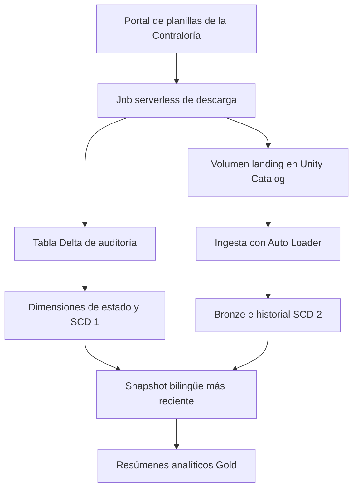

# Datos Abiertos de Panamá — Databricks Bundle

[English](README.md)

Pipeline de datos de extremo a extremo en Databricks que descarga datos públicos de planillas de la Contraloría General de la República de Panamá, almacena los archivos fuente en un volumen de Unity Catalog, conserva el historial de los empleados y genera tablas listas para analítica.

El proyecto se despliega como un Databricks Asset Bundle y utiliza un job serverless, Lakeflow Declarative Pipelines, Auto Loader, Delta Lake, Unity Catalog, Auto CDC, Photon y Databricks AI Functions.

> Este es un proyecto independiente y no constituye una publicación oficial del Gobierno de Panamá ni de la Contraloría General de la República.

## Qué hace el proyecto

- Verifica si el portal público de la Contraloría contiene una versión más reciente de los datos.
- Descarga los reportes de planilla por institución y estado laboral.
- Limpia los archivos de Excel y los guarda como Parquet en un volumen administrado de Unity Catalog.
- Registra cada consulta a la fuente en una tabla Delta de auditoría.
- Inicia el pipeline de transformación solamente cuando se descargaron archivos nuevos.
- Ingiere los archivos incrementalmente con Auto Loader.
- Conserva los cambios de los empleados mediante SCD Type 2.
- Mantiene el último estado de la API por institución mediante SCD Type 1.
- Traduce al inglés los nombres de instituciones, estados laborales y cargos.
- Genera vistas analíticas del estado actual, empleados inactivos y resúmenes por empleado e institución.

## Arquitectura



El workflow de Databricks ejecuta las siguientes tareas:

1. `descargar_datos_contraloria` consulta la fuente y descarga los reportes nuevos.
2. `revisar_actualizaciones` evalúa el valor `updates` producido por la tarea anterior.
3. `update_contraloria_schema` ejecuta el pipeline de Lakeflow solamente cuando `updates > 0`.

El job está programado para ejecutarse los lunes, miércoles y viernes a las 4:20 a. m. en la zona horaria `America/Panama`.

## Principales objetos de datos

| Capa | Objeto | Propósito |
|---|---|---|
| Control | `control_de_actualizaciones_contraloria` | Historial de auditoría de consultas, descargas, duración y estado |
| Control | `utlima_actualizacion_contraloria` | Último registro por institución y estado mediante SCD Type 1 |
| Referencia | `dim_instituciones_contraloria` | Nombres de instituciones en español e inglés |
| Referencia | `dim_estados_contraloria` | Nombres de estados laborales en español e inglés |
| Referencia | `dim_cargos_contraloria` | Nombres de cargos en español e inglés |
| Bronze | `bronze_planilla_contraloria` | Registros crudos de planilla ingeridos incrementalmente desde Parquet |
| Historial | `bronze_planilla_contraloria_scd_type2` | Historial completo de cambios en salario, gasto y fecha de inicio |
| Actual | `ultima_actualizacion_planilla_contraloria` | Snapshot bilingüe más reciente de los empleados |
| Calidad | `empleado_inactivo_planilla_contraloria` | Empleados activos en el historial SCD que no aparecen en el último snapshot |
| Gold | `resumen_planilla_por_empleados` | Resumen de compensación, antigüedad, cargos y variaciones de nombre por empleado |
| Gold | `resumen_por_institucion_y_puesto` | Métricas de personal, compensación y antigüedad por institución, estado y cargo |

> `utlima_actualizacion_contraloria` conserva la escritura utilizada actualmente en el código del pipeline.

## Estructura del repositorio

```text
.
├── databricks.yml
├── resources/
│   ├── jobs.yml
│   ├── pipelines.yml
│   └── unity_catalog.yml
├── src/
│   ├── consulta_y_descarga_contraloria.py
│   └── contraloria/
│       └── descarga_de_archivos.py
├── transformations/
│   ├── api_logs.py
│   └── planilla.py
├── sql/
│   └── setup.sql
├── tests/
├── fixtures/
├── pyproject.toml
├── requirements.txt
└── setup.py
```

## Requisitos

- Un workspace de Databricks con Unity Catalog.
- Permisos para desplegar jobs y pipelines y crear schemas y volúmenes.
- Jobs serverless y Lakeflow Declarative Pipelines serverless habilitados.
- Databricks AI Functions disponible para utilizar `ai_translate`.
- Databricks CLI instalado localmente.
- Python 3.10, 3.11 o 3.12.
- Se recomienda utilizar `uv` para administrar dependencias y builds.

El catálogo configurado en `catalog` debe existir antes de desplegar el bundle. El bundle crea el schema de Contraloría y el volumen administrado `landing`, pero actualmente no declara el catálogo como recurso.

En un workspace con almacenamiento administrado predeterminado, el catálogo puede crearse desde el editor de Databricks SQL:

```sql
CREATE CATALOG IF NOT EXISTS panama_datos_abiertos;
```

Si el workspace requiere una ubicación de almacenamiento explícita, crea el catálogo con el managed location apropiado para tu ambiente.

## Configuración local

Clona el repositorio:

```bash
git clone https://github.com/jquesada92/databricks-bundle-panama-datos-abiertos.git
cd databricks-bundle-panama-datos-abiertos
```

Instala las dependencias de desarrollo:

```bash
uv sync --dev
```

Autentícate en el workspace configurado en `databricks.yml`:

```bash
databricks auth login --host {{YOUR URL HOST}}
```

Si modificas el paquete de Python, vuelve a construir el wheel utilizado por el job:

```bash
uv build
```

Actualmente, el job espera el siguiente archivo:

```text
dist/public_data_panama_gov-0.0.1-py3-none-any.whl
```

## Validación y despliegue

### Target personal de desarrollo

`personal` es el target predeterminado. Despliega los recursos en modo de desarrollo bajo la ruta del usuario actual.

```bash
databricks bundle validate -t personal
databricks bundle deploy -t personal
```

### Target compartido

`shared` utiliza el modo de producción, despliega bajo `/Workspace/Shared`, habilita la protección contra destrucción y deshabilita el modo de desarrollo del pipeline.

```bash
databricks bundle validate -t shared
databricks bundle deploy -t shared
```

## Ejecución del workflow

Ejecuta el workflow completo de ingesta:

```bash
databricks bundle run -t personal job_contraloria
```

Ejecuta solamente el pipeline de transformación sobre los archivos existentes en el volumen landing:

```bash
databricks bundle run -t personal dlt_contraloria
```

Reemplaza `personal` por `shared` para ejecutar el despliegue compartido.

## Configuración

Las variables se declaran en `databricks.yml`.

| Variable | Valor predeterminado | Descripción |
|---|---|---|
| `catalog` | `panama_datos_abiertos` | Catálogo existente de Unity Catalog |
| `contraloria_schema` | `contraloria` | Schema creado para los objetos del pipeline |
| `contraloria_volume` | `landi` | Variable declarada; el recurso actual utiliza el nombre fijo `landing` |
| `warehouse_id` | `{{YOUR WAREHOUSE ID}}` | Declarado para el setup, pero ningún recurso del bundle lo utiliza actualmente |
| `prevent_destroy` | `false` | Controla la protección del ciclo de vida del schema y el volumen |
| `pipeline_mode_development` | `false` | Controla el modo de desarrollo del pipeline de Lakeflow |

Ejemplo para sobrescribir variables:

```bash
databricks bundle deploy -t personal \
  --var="catalog=my_catalog,contraloria_schema=my_schema"
```

Comportamiento por target:

| Target | Modo | Ruta raíz | Protección contra destrucción | Desarrollo del pipeline |
|---|---|---|---|---|
| `personal` | Desarrollo | Workspace del usuario actual | Deshabilitada | Habilitado |
| `shared` | Producción | `/Workspace/Shared/...` | Habilitada | Deshabilitado |

## Validaciones de desarrollo

Ejecuta la estructura de pruebas:

```bash
uv run pytest
```

Ejecuta Ruff:

```bash
uv run ruff check .
```

Valida siempre el bundle antes de desplegar:

```bash
databricks bundle validate -t personal
```

## Consideraciones operativas y de responsabilidad de datos

- La fuente contiene nombres, números de identificación, cargos e información salarial. Aunque la fuente sea pública, maneja los resultados conforme a las leyes aplicables, los términos de la fuente y las políticas de tu organización.
- El código de extracción actualmente deshabilita la validación del certificado TLS para las solicitudes a la fuente. Revisa y fortalece este comportamiento antes de utilizar el proyecto en producción.
- Las columnas de referencia en inglés dependen de `ai_translate`; el pipeline puede fallar si la función no está disponible o autorizada.
- La estructura HTML y el formato de los reportes de la fuente pueden cambiar. Los errores de extracción se registran en la tabla de auditoría y deben monitorearse.
- El repositorio no incluye actualmente un archivo de licencia.

## Fuente y documentación

- [Portal de planillas de la Contraloría](https://www.contraloria.gob.pa/CGR.PLANILLAGOB.UI/Formas)
- [Databricks Declarative Automation Bundles](https://docs.databricks.com/aws/en/dev-tools/bundles/)
- [Databricks Auto Loader](https://docs.databricks.com/aws/en/ingestion/cloud-object-storage/auto-loader/)
- [Lakeflow Declarative Pipelines](https://docs.databricks.com/aws/en/ldp/)

## Autor

[Jose Quesada](https://github.com/jquesada92)
