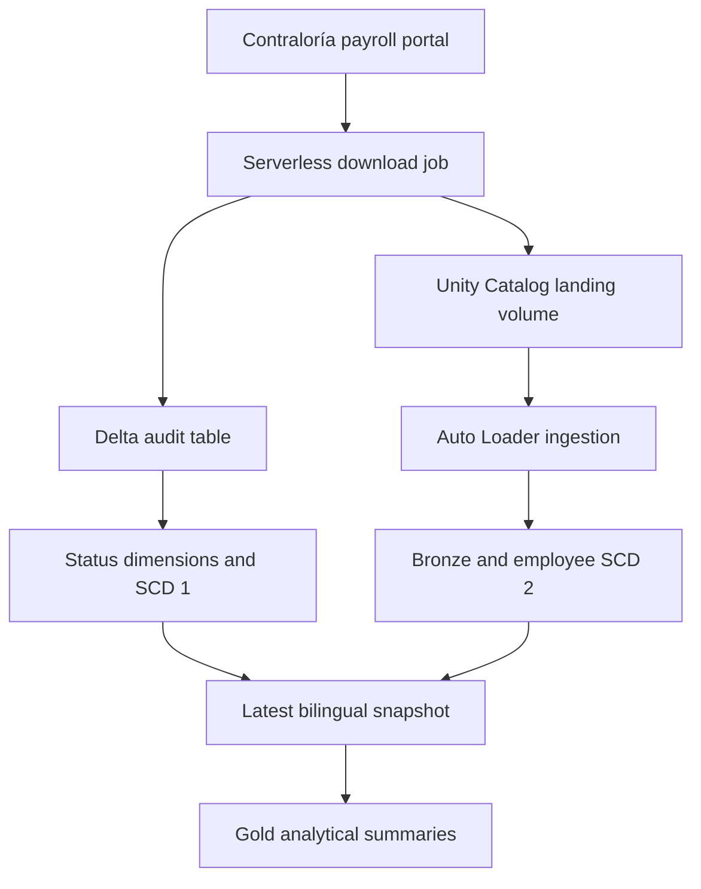

# Panama Open Government Data — Databricks Bundle

[Español](README.es.md)

An end-to-end Databricks data pipeline that downloads public payroll data from Panama's Office of the Comptroller General (Contraloría General de la República), stores source files in a Unity Catalog volume, preserves employee history, and produces analytics-ready tables.

The project is deployed as a Databricks Asset Bundle and uses a serverless job, Lakeflow Declarative Pipelines, Auto Loader, Delta Lake, Unity Catalog, Auto CDC, Photon, and Databricks AI Functions.

> This is an independent project and is not an official publication of the Government of Panama or the Comptroller General.

## What the project does

- Checks the public Contraloría portal for a newer source-data version.
- Downloads payroll reports by institution and employment status.
- Cleans the Excel reports and writes them as Parquet files to a managed Unity Catalog volume.
- Records every source check in a Delta audit table.
- Starts the transformation pipeline only when new files were downloaded.
- Ingests the files incrementally with Auto Loader.
- Preserves employee changes with SCD Type 2.
- Maintains the latest API status per institution with SCD Type 1.
- Translates institution, employment-status, and position names from Spanish to English.
- Produces current-state, inactive-employee, employee-level, and institution-level analytical views.

## Architecture



The Databricks workflow runs the following tasks:

1. `descargar_datos_contraloria` checks the source and downloads new reports.
2. `revisar_actualizaciones` evaluates the `updates` task value.
3. `update_contraloria_schema` runs the Lakeflow pipeline only when `updates > 0`.

The job is scheduled for Monday, Wednesday, and Friday at 4:20 a.m. in the `America/Panama` time zone.

## Main data objects

| Layer | Object | Purpose |
|---|---|---|
| Control | `control_de_actualizaciones_contraloria` | Audit history for source checks, downloads, timing, and status |
| Control | `utlima_actualizacion_contraloria` | Latest source-check record per institution and status using SCD Type 1 |
| Reference | `dim_instituciones_contraloria` | Institution names in Spanish and English |
| Reference | `dim_estados_contraloria` | Employment-status names in Spanish and English |
| Reference | `dim_cargos_contraloria` | Position names in Spanish and English |
| Bronze | `bronze_planilla_contraloria` | Raw incremental payroll records ingested from Parquet |
| History | `bronze_planilla_contraloria_scd_type2` | Full employee history for salary, allowance, and start-date changes |
| Current | `ultima_actualizacion_planilla_contraloria` | Latest bilingual employee snapshot |
| Quality | `empleado_inactivo_planilla_contraloria` | Employees active in SCD history but missing from the latest snapshot |
| Gold | `resumen_planilla_por_empleados` | Compensation, tenure, positions, and name-variation summary per employee |
| Gold | `resumen_por_institucion_y_puesto` | Headcount, compensation, and tenure metrics by institution, status, and position |

> `utlima_actualizacion_contraloria` reflects the spelling currently used by the pipeline source code.

## Repository structure

```text
.
├── databricks.yml
├── resources/
│   ├── jobs.yml
│   ├── pipelines.yml
│   └── unity_catalog.yml
├── src/
│   ├── consulta_y_descarga_contraloria.py
│   └── contraloria/
│       └── descarga_de_archivos.py
├── transformations/
│   ├── api_logs.py
│   └── planilla.py
├── sql/
│   └── setup.sql
├── tests/
├── fixtures/
├── pyproject.toml
├── requirements.txt
└── setup.py
```

## Prerequisites

- A Databricks workspace with Unity Catalog.
- Permission to deploy jobs and pipelines and to create schemas and volumes.
- Serverless jobs and serverless Lakeflow Declarative Pipelines enabled.
- Databricks AI Functions available for `ai_translate`.
- A local installation of the Databricks CLI.
- Python 3.10, 3.11, or 3.12.
- `uv` is recommended for dependency and build management.

The catalog configured by `catalog` must exist before bundle deployment. The bundle creates the Contraloría schema and the managed `landing` volume, but it does not currently declare a catalog resource.

For a workspace with default managed storage, the catalog can be created from the Databricks SQL editor:

```sql
CREATE CATALOG IF NOT EXISTS panama_datos_abiertos;
```

If the workspace requires an explicit storage location, create the catalog with the appropriate managed location for your environment.

## Local setup

Clone the repository:

```bash
git clone https://github.com/jquesada92/databricks-bundle-panama-datos-abiertos.git
cd databricks-bundle-panama-datos-abiertos
```

Install the development dependencies:

```bash
uv sync --dev
```

Authenticate to the workspace configured in `databricks.yml`:

```bash
databricks auth login --host {{YOUR URL HOST}}
```

If the Python package changes, rebuild the wheel referenced by the job:

```bash
uv build
```

The job currently expects:

```text
dist/public_data_panama_gov-0.0.1-py3-none-any.whl
```

## Validate and deploy

### Personal development target

The `personal` target is the default. It deploys resources in development mode under the current user's workspace path.

```bash
databricks bundle validate -t personal
databricks bundle deploy -t personal
```

### Shared target

The `shared` target uses production mode, deploys under `/Workspace/Shared`, enables destruction protection, and disables pipeline development mode.

```bash
databricks bundle validate -t shared
databricks bundle deploy -t shared
```

## Run the workflow

Run the complete ingestion workflow:

```bash
databricks bundle run -t personal job_contraloria
```

Run only the transformation pipeline against files already present in the landing volume:

```bash
databricks bundle run -t personal dlt_contraloria
```

Replace `personal` with `shared` when running the shared deployment.

## Configuration

Variables are declared in `databricks.yml`.

| Variable | Default | Description |
|---|---|---|
| `catalog` | `panama_datos_abiertos` | Existing Unity Catalog catalog |
| `contraloria_schema` | `contraloria` | Schema created for pipeline objects |
| `contraloria_volume` | `landi` | Declared variable; the current volume resource is hard-coded as `landing` |
| `warehouse_id` | `{{YOUR WAREHOUSE ID}}` | Declared for setup use but not currently referenced by a bundle resource |
| `prevent_destroy` | `false` | Controls lifecycle protection for the schema and volume |
| `pipeline_mode_development` | `false` | Controls Lakeflow pipeline development mode |

Example override:

```bash
databricks bundle deploy -t personal \
  --var="catalog=my_catalog,contraloria_schema=my_schema"
```

Target-specific behavior:

| Target | Mode | Root path | Destruction protection | Pipeline development |
|---|---|---|---|---|
| `personal` | Development | Current user's workspace | Disabled | Enabled |
| `shared` | Production | `/Workspace/Shared/...` | Enabled | Disabled |

## Development checks

Run the test scaffold:

```bash
uv run pytest
```

Run Ruff:

```bash
uv run ruff check .
```

Always validate the bundle before deployment:

```bash
databricks bundle validate -t personal
```

## Operational and data-responsibility notes

- The source contains names, identification numbers, job titles, and compensation information. Even when the source is public, handle the resulting data according to applicable laws, source terms, and organizational policies.
- The extraction code currently disables TLS certificate verification for source requests. Review and harden this behavior before using the project in a production environment.
- The English reference columns depend on Databricks `ai_translate`; pipeline execution can fail if that function is unavailable or unauthorized.
- Source-site HTML and report formats can change. Extraction failures are recorded in the audit table and should be monitored.
- The repository does not currently include a license file.

## Source and documentation

- [Contraloría payroll portal](https://www.contraloria.gob.pa/CGR.PLANILLAGOB.UI/Formas)
- [Databricks Declarative Automation Bundles](https://docs.databricks.com/aws/en/dev-tools/bundles/)
- [Databricks Auto Loader](https://docs.databricks.com/aws/en/ingestion/cloud-object-storage/auto-loader/)
- [Lakeflow Declarative Pipelines](https://docs.databricks.com/aws/en/ldp/)

## Author

[Jose Quesada](https://github.com/jquesada92)
