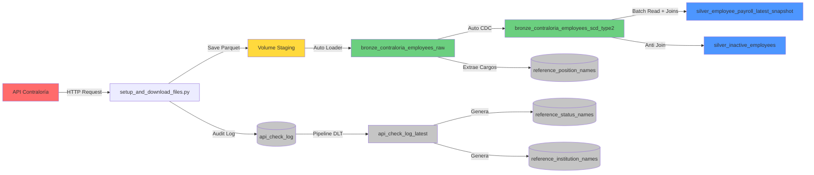

# 🏛️ Pipeline de Nómina - Contraloría General de la República de Panamá

[](https://www.linkedin.com/in/jquesada92/)
[](https://databricks.com)
[](https://www.python.org/)

## 📋 Descripción

Pipeline de datos empresarial para la extracción, procesamiento y análisis de información de nómina de empleados públicos de la República de Panamá, obtenida desde la API oficial de la Contraloría General de la República.

Este proyecto implementa una arquitectura de datos moderna utilizando **Spark Declarative Pipelines (Delta Live Tables)** en **Databricks**, siguiendo el patrón **Medallion Architecture** (Bronze → Silver) con capacidades avanzadas de seguimiento histórico mediante **SCD Type 2** y **Liquid Clustering** para optimización de rendimiento.

---

## 🏗️ Arquitectura del Sistema

### Diagrama de Arquitectura General

```
┌─────────────────────────────────────────────────────────────────────────────┐
│                          ARQUITECTURA MEDALLION                              │
└─────────────────────────────────────────────────────────────────────────────┘

┌──────────────────┐       ┌──────────────────┐       ┌──────────────────┐
│                  │       │                  │       │                  │
│   API Externa    │──────▶│  Volume Staging  │──────▶│   Bronze Layer   │
│   Contraloría    │       │  (Parquet Files) │       │  (Raw Ingestion) │
│                  │       │                  │       │                  │
└──────────────────┘       └──────────────────┘       └────────┬─────────┘
                                                                │
                            ┌───────────────────────────────────┘
                            │
                            ▼
                     ┌─────────────────┐
                     │                 │
                     │  Bronze SCD-2   │◀─── Auto CDC Flow
                     │  (Historical)   │     (Change Tracking)
                     │                 │
                     └────────┬────────┘
                              │
                              ▼
                     ┌─────────────────┐
                     │                 │
                     │  Silver Layer   │◀─── Materialized View
                     │  (Curated Data) │     (Snapshot Actual)
                     │                 │
                     └─────────────────┘
```

### Flujo de Datos Detallado



---

## 📊 Capas de Datos

### 🥉 Bronze Layer (Datos Crudos)

#### `bronze_contraloria_employees_raw`
* **Tipo**: Streaming Table
* **Fuente**: Auto Loader (cloudFiles) desde Unity Catalog Volume
* **Propósito**: Ingesta incremental de archivos Parquet
* **Características**:
  * Procesamiento automático de nuevos archivos
  * Esquema explícito predefinido
  * Sin transformaciones (datos tal cual desde la fuente)
  * **Liquid Clustering** por: `institucion`, `fecha_consulta`
  * Columnas calculadas: `composite_key`, `antiguedad` (años de servicio)

#### `bronze_contraloria_employees_scd_type2`
* **Tipo**: Streaming Table con SCD Type 2
* **Fuente**: `bronze_contraloria_employees_raw` via Auto CDC
* **Propósito**: Historial completo de cambios por empleado
* **Claves Primarias**:
  * 🔑 `cedula` (cédula)
  * 👤 `nombre` (nombre)
  * 👤 `apellido` (apellido)
  * 💼 `cargo` (cargo)
  * 📊 `estado` (estado)
* **Columnas Rastreadas** (historial):
  * 💰 `salario` (salario)
  * 💵 `gasto` (gastos de representación)
  * 📅 `fecha_de_inicio` (fecha de inicio)
* **Liquid Clustering** por: `cedula`, `institucion`, `estado`

**Visualización de SCD Type 2:**

```
┌────────────────────────────────────────────────────────────────────┐
│                    Registro SCD Type 2 Example                     │
├────────────┬──────────┬─────────┬────────────┬──────────┬─────────┤
│ cedula     │ nombre   │ salario │ __START_AT │ __END_AT │ __ACTION│
├────────────┼──────────┼─────────┼────────────┼──────────┼─────────┤
│ 8-123-4567 │ Juan     │ 1500.00 │ 2025-01-01 │ 2025-06-01│ UPDATE │ ◄── Versión antigua
│ 8-123-4567 │ Juan     │ 1800.00 │ 2025-06-01 │ NULL      │ INSERT │ ◄── Versión actual
└────────────┴──────────┴─────────┴────────────┴──────────┴─────────┘
```

### 🥈 Silver Layer (Datos Limpios y Curados)

#### `silver_employee_payroll_latest_snapshot`
* **Tipo**: Materialized View
* **Fuente**: `bronze_contraloria_employees_raw` (batch read)
* **Propósito**: Snapshot actual de empleados con traducciones al inglés
* **Transformaciones**:
  * ✅ Joins con tablas de referencia (instituciones, estados, cargos)
  * ✅ **Broadcast joins** para tablas de dimensión (optimización de rendimiento)
  * ✅ Traducción de columnas español → inglés
  * ✅ Campo calculado: `years_of_service` (años de servicio)
  * ✅ **Liquid Clustering** por: `institution_sp`, `status_sp`

#### `silver_inactive_employees`
* **Tipo**: Materialized View
* **Fuente**: `bronze_contraloria_employees_scd_type2` + `silver_employee_payroll_latest_snapshot`
* **Propósito**: Detectar empleados marcados como activos en SCD pero ausentes en último snapshot
* **Casos de Uso**:
  * 🚨 Identificar terminaciones de empleados
  * 🔍 Validación de calidad de datos
  * 📊 Rastrear registros faltantes de la API
* **Método**: LEFT ANTI JOIN para rendimiento óptimo

---

## 📁 Estructura del Proyecto

```
contraloria_panama/
│
├── 📄 README.md                          # Documentación en inglés
├── 📄 README_ES.md                       # Documentación en español (este archivo)
│
├── 📄 requirements.txt                   # Dependencias Python
├── 🚫 .gitignore                         # Exclusiones de Git
│
├── 🐍 setup_and_download_files.py        # Script de extracción API
│   ├── Crea catálogos y esquemas
│   ├── Crea tabla api_check_log
│   ├── Descarga datos desde API
│   ├── Guarda directamente en Unity Catalog Volume staging
│   └── Registra auditoría
│
├── 📂 transformations/
│   ├── 🐍 dlt_pipeline_contraloria.py    # Definición principal del pipeline DLT
│   │   ├── Bronze: Auto Loader ingestion
│   │   ├── Bronze: Auto CDC (SCD Type 2)
│   │   ├── Silver: Snapshot actual con traducciones
│   │   └── Silver: Detección de empleados inactivos
│   ├── 🐍 dlt_reference_audit.py         # Pipeline de tablas de referencia y auditoría
│   │   ├── Crea api_check_log_latest (SCD Type 1)
│   │   ├── Genera reference_institution_names
│   │   ├── Genera reference_status_names
│   │   └── Genera reference_position_names
│   └── 🐍 config.py                      # Configuración del pipeline (rutas, esquemas)
│
├── 📂 utils/
│   ├── 🐍 contraloria.py                 # Utilidades del cliente API
│   ├── 🐍 config.py                      # Configuración global
│   └── 🐍 __init__.py                    # Inicialización del módulo
│
└── 📂 staging/                           # Archivos temporales (workspace, no versionados)
    └── 📊 InformeConsultaPlanilla_*.parquet
```

---

## ⚙️ Configuración del Pipeline

### Pipeline Principal: `dlt_contraloria`

| Parámetro | Valor | Descripción |
|-----------|-------|-------------|
| **Nombre** | `dlt_contraloria` | Identificador del pipeline |
| **Catalog** | `contraloria` | Catálogo de Unity Catalog |
| **Schema** | `employee_payroll` | Esquema de destino para tablas principales |
| **Compute** | Serverless | Sin gestión de clusters |
| **Photon** | ✅ Habilitado | Motor de ejecución optimizado |
| **Modo** | Triggered | Ejecución bajo demanda |
| **Tipo de Pipeline** | Workspace | Archivos del workspace |
| **Archivo Principal** | `/transformations/dlt_pipeline_contraloria.py` | Definición del DAG |
| **Optimización** | Liquid Clustering | Queries auto-optimizadas |

### Pipeline de Referencia: `dlt_reference_audit`

| Parámetro | Valor | Descripción |
|-----------|-------|-------------|
| **Nombre** | `dlt_reference_audit` | Identificador del pipeline |
| **Catalog** | `contraloria` | Catálogo de Unity Catalog |
| **Schema** | `reference_and_audit` | Esquema para tablas de referencia |
| **Fuente** | `api_check_log` + Tablas Bronze | Genera tablas de referencia |

---

## 🚀 Guía de Instalación

### Prerrequisitos

* ✅ Workspace de Databricks con Unity Catalog habilitado
* ✅ Permisos para crear catálogos, esquemas y tablas
* ✅ Acceso de lectura/escritura en workspace
* ✅ Unity Catalog Volume creado: `contraloria.reference_and_audit.contraloria_staging`
* ✅ Credenciales de API (si aplica)

### Paso 1️⃣: Configurar Base de Datos y Extraer Datos

Ejecutar el script de configuración:

```python
%run ./setup_and_download_files.py
```

**Este script realiza las siguientes acciones:**

1. 🗄️ Crea el catálogo `contraloria`
2. 📂 Crea los esquemas `employee_payroll` y `reference_and_audit`
3. 📝 Crea tabla de auditoría: `api_check_log`
4. 🌐 Extrae datos desde la API de la Contraloría
5. 💾 Guarda archivos Parquet **directamente en el Unity Catalog Volume** (`/Volumes/contraloria/reference_and_audit/contraloria_staging/`)
6. 📊 Registra metadatos de extracción

**Nota**: El script guarda archivos directamente en el Unity Catalog Volume. El Volume debe existir antes de ejecutar el script.

### Paso 2️⃣: Ejecutar Pipeline de Referencia (Solo Primera Vez)

Las tablas de referencia son creadas por el pipeline DLT, no por el script de configuración.

**Ejecutar este pipeline primero:**

```python
# Navegar a Data Engineering → Pipelines → dlt_reference_audit
# Hacer clic en ▶️ Start with Full Refresh
```

**Este pipeline crea:**
* 📋 `reference_status_names` - Estados de empleo (traducciones español/inglés via AI)
* 📋 `reference_institution_names` - Instituciones públicas (traducciones español/inglés via AI)
* 📋 `reference_position_names` - Cargos (traducciones español/inglés via AI)
* 📊 `api_check_log_latest` - Registros más recientes de verificación de API (SCD Type 1)

### Paso 3️⃣: Ejecutar Pipeline Principal

**Opción A - Interfaz Web:**

1. Navegar a **Data Engineering** → **Pipelines**
2. Seleccionar pipeline `dlt_contraloria`
3. Hacer clic en **▶️ Start** o **🔄 Start with Full Refresh**
4. Monitorear progreso en vista de grafo

**Opción B - Código Python:**

```python
# Obtener actualizaciones del script de extracción
updates = dbutils.jobs.taskValues.get(taskKey="extraction", key="updates")
print(f"Procesadas {updates} actualizaciones")
```

---

## 📊 Esquema de Datos

### Tabla Principal: `silver_employee_payroll_latest_snapshot`

**Ruta completa**: `contraloria.employee_payroll.silver_employee_payroll_latest_snapshot`

| Columna | Tipo | Nullable | Descripción | Ejemplo |
|---------|------|---------|-------------|---------|
| `composite_key` | STRING | ❌ | Identificador compuesto único | `JUAN-RODRIGUEZ-TRIBUNAL-ANALYST-8123...` |
| `first_name` | STRING | ✅ | Nombre(s) del empleado | `JUAN CARLOS` |
| `last_name` | STRING | ✅ | Apellido(s) del empleado | `RODRIGUEZ PEREZ` |
| `id_number` | STRING | ❌ | Número de cédula | `8-123-4567` |
| `salary` | DOUBLE | ✅ | Salario base mensual (USD) | `1500.00` |
| `allowance` | DOUBLE | ✅ | Gastos de representación (USD) | `300.00` |
| `status_sp` | STRING | ✅ | Estado de empleo (Español) | `PERMANENTE` |
| `status_en` | STRING | ✅ | Estado de empleo (Inglés) | `PERMANENT` |
| `institution_sp` | STRING | ✅ | Institución (Español) | `TRIBUNAL ELECTORAL` |
| `institution_en` | STRING | ✅ | Institución (Inglés) | `ELECTORAL COURT` |
| `position_sp` | STRING | ✅ | Cargo (Español) | `ANALISTA` |
| `position_en` | STRING | ✅ | Cargo (Inglés) | `ANALYST` |
| `start_date` | DATE | ✅ | Fecha de inicio en el cargo | `2020-01-15` |
| `query_date` | TIMESTAMP | ✅ | Fecha de actualización desde la fuente | `2025-01-15 00:00:00` |
| `snapshot_date` | TIMESTAMP | ✅ | Fecha de consulta/extracción | `2025-01-15 12:00:00` |
| `years_of_service` | DOUBLE | ✅ | Años en el cargo | `4.5` |
| `file` | STRING | ✅ | Nombre del archivo fuente | `InformeConsultaPlanilla_2025-01.parquet` |

### Tabla de Empleados Inactivos: `silver_inactive_employees`

**Ruta completa**: `contraloria.employee_payroll.silver_inactive_employees`

| Columna | Tipo | Descripción |
|---------|------|-------------|
| `cedula` | STRING | Número de cédula |
| `nombre` | STRING | Nombre |
| `apellido` | STRING | Apellido |
| `cargo` | STRING | Cargo |
| `estado` | STRING | Estado |
| `institucion` | STRING | Institución |
| `salario` | DOUBLE | Último salario conocido |
| `gasto` | DOUBLE | Últimos gastos conocidos |
| `fecha_de_inicio` | DATE | Fecha de inicio |
| `__START_AT` | TIMESTAMP | Cuando el registro se volvió activo en SCD |

### Claves y Restricciones

**Claves Primarias (SCD Type 2):**
* `(cedula, nombre, apellido, cargo, estado)`

**Columna de Secuencia**: `fecha_consulta` (para ordenamiento temporal en CDC)

**Claves de Clustering:**
* **Bronze Raw**: `(institucion, fecha_consulta)`
* **Bronze SCD-2**: `(cedula, institucion, estado)`
* **Silver Snapshot**: `(institution_sp, status_sp)`

---

## 🔄 Proceso de Actualización

### Flujo de Trabajo Completo

```
┌─────────────────────────────────────────────────────────────────────┐
│ PASO 1: EXTRACCIÓN                                                  │
├─────────────────────────────────────────────────────────────────────┤
│ 1. Script consulta API de la Contraloría                            │
│ 2. Verifica fecha de última actualización en la fuente              │
│ 3. Descarga solo registros nuevos/modificados                       │
│ 4. Guarda en formato Parquet optimizado directamente en Volume      │
│ 5. Registra metadatos en tabla de auditoría                         │
└─────────────────────────────────────────────────────────────────────┘
                             ⬇️
┌─────────────────────────────────────────────────────────────────────┐
│ PASO 2: TABLAS DE REFERENCIA (Pipeline DLT de Referencia)           │
├─────────────────────────────────────────────────────────────────────┤
│ 1. Lee tabla api_check_log                                          │
│ 2. Crea api_check_log_latest (SCD Type 1)                           │
│ 3. Genera reference_institution_names con traducciones              │
│ 4. Genera reference_status_names con traducciones                   │
│ 5. Extrae cargos del bronze y genera traducciones                   │
└─────────────────────────────────────────────────────────────────────┘
                             ⬇️
┌─────────────────────────────────────────────────────────────────────┐
│ PASO 3: INGESTA (BRONZE RAW)                                        │
├─────────────────────────────────────────────────────────────────────┤
│ 1. Auto Loader detecta nuevos archivos en Volume staging/           │
│ 2. Lee solo archivos no procesados                                  │
│ 3. Aplica esquema explícito predefinido                             │
│ 4. Escribe en bronze_contraloria_employees_raw                      │
│ 5. Agrega columnas composite_key y antiguedad                       │
└─────────────────────────────────────────────────────────────────────┘
                             ⬇️
┌─────────────────────────────────────────────────────────────────────┐
│ PASO 4: HISTORIZACIÓN (BRONZE SCD-2)                                │
├─────────────────────────────────────────────────────────────────────┤
│ 1. Auto CDC lee stream desde bronze_contraloria_employees_raw       │
│ 2. Detecta INSERTs, UPDATEs basados en claves compuestas            │
│ 3. Cierra registros antiguos (__END_AT = timestamp)                 │
│ 4. Inserta nuevas versiones (__END_AT = NULL)                       │
│ 5. Agrega columnas __START_AT, __END_AT, __ACTION                   │
│ 6. Rastrea historial para: salario, gasto, fecha_de_inicio          │
└─────────────────────────────────────────────────────────────────────┘
                             ⬇️
┌─────────────────────────────────────────────────────────────────────┐
│ PASO 5: CURACIÓN (SILVER)                                           │
├─────────────────────────────────────────────────────────────────────┤
│ 1. Lectura batch desde bronze_contraloria_employees_raw             │
│ 2. Broadcast joins con tablas de referencia                         │
│ 3. Traduce columnas español → inglés                                │
│ 4. Calcula years_of_service                                         │
│ 5. Materializa vista optimizada con Liquid Clustering               │
│ 6. Detecta empleados inactivos via anti-join                        │
└─────────────────────────────────────────────────────────────────────┘
```

### Frecuencia Recomendada

| Proceso | Frecuencia Sugerida | Razón |
|---------|---------------------|-------|
| **Extracción API** | Mensual | La fuente se actualiza mensualmente |
| **Pipeline de Referencia** | Post-extracción | Generar traducciones para datos nuevos |
| **Pipeline DLT Principal** | Post-pipeline de referencia | Procesar solo cuando llegan datos nuevos |
| **Monitoreo** | Diario | Validar calidad y completitud |

---

## 📈 Consultas de Análisis

### 1️⃣ Empleados por Institución

```sql
SELECT 
  institution_en,
  COUNT(*) as total_employees,
  SUM(salary) as total_salary_budget,
  SUM(allowance) as total_allowance_budget,
  AVG(salary) as avg_salary,
  MAX(salary) as max_salary
FROM contraloria.employee_payroll.silver_employee_payroll_latest_snapshot
GROUP BY institution_en
ORDER BY total_employees DESC;
```

**Salida esperada:**
```
┌───────────────────────────┬──────────────────┬──────────────────────┐
│ institution_en            │ total_employees  │ total_salary_budget  │
├───────────────────────────┼──────────────────┼──────────────────────┤
│ ELECTORAL COURT           │ 2,450            │ 4,125,000.00         │
│ COURT OF ACCOUNTS         │ 1,890            │ 3,215,500.00         │
│ ADMINISTRATIVE COURT      │ 1,234            │ 2,100,300.00         │
└───────────────────────────┴──────────────────┴──────────────────────┘
```

### 2️⃣ Top 100 Salarios Más Altos

```sql
SELECT 
  id_number,
  CONCAT(first_name, ' ', last_name) as full_name,
  institution_en,
  position_en,
  salary,
  allowance,
  (salary + allowance) as total_compensation
FROM contraloria.employee_payroll.silver_employee_payroll_latest_snapshot
ORDER BY total_compensation DESC
LIMIT 100;
```

### 3️⃣ Historial Completo de Empleado

```sql
SELECT 
  cedula,
  nombre,
  apellido,
  cargo,
  salario,
  estado,
  __START_AT as valid_from,
  COALESCE(__END_AT, CURRENT_TIMESTAMP()) as valid_to,
  __ACTION as change_type
FROM contraloria.employee_payroll.bronze_contraloria_employees_scd_type2
WHERE cedula = '8-123-4567'
ORDER BY __START_AT DESC;
```

### 4️⃣ Distribución por Estado de Empleo

```sql
SELECT 
  status_en,
  COUNT(*) as employee_count,
  ROUND(COUNT(*) * 100.0 / SUM(COUNT(*)) OVER(), 2) as percentage
FROM contraloria.employee_payroll.silver_employee_payroll_latest_snapshot
GROUP BY status_en
ORDER BY employee_count DESC;
```

### 5️⃣ Años Promedio de Servicio por Institución

```sql
SELECT 
  institution_en,
  AVG(years_of_service) as avg_years_service,
  MIN(years_of_service) as min_years,
  MAX(years_of_service) as max_years
FROM contraloria.employee_payroll.silver_employee_payroll_latest_snapshot
GROUP BY institution_en
ORDER BY avg_years_service DESC;
```

### 6️⃣ Empleados Inactivos (Posibles Terminaciones)

```sql
SELECT 
  cedula,
  CONCAT(nombre, ' ', apellido) as full_name,
  institucion,
  cargo,
  estado,
  salario,
  __START_AT as became_active_on
FROM contraloria.employee_payroll.silver_inactive_employees
ORDER BY __START_AT DESC
LIMIT 100;
```

---

## 🛠️ Mantenimiento y Operaciones

### Monitoreo

#### 1. Estado del Pipeline
```python
# Verificar última actualización
from databricks import pipelines
pipeline_id = "ffbae848-bc88-4c0e-89a3-32768ee1fc79"
# Ver detalles en la UI del pipeline
```

#### 2. Logs de Auditoría de API
```sql
SELECT 
  institution_name_spanish,
  status_name_spanish,
  run_status,
  source_update,
  checked_at,
  time as execution_time_seconds
FROM contraloria.reference_and_audit.api_check_log
WHERE checked_at >= CURRENT_DATE() - INTERVAL 7 DAYS
ORDER BY checked_at DESC;
```

#### 3. Calidad de Datos - Verificar Registros Faltantes
```sql
-- Contar empleados inactivos (presentes en SCD pero no en último snapshot)
SELECT COUNT(*) as inactive_count
FROM contraloria.employee_payroll.silver_inactive_employees;

-- Comparar conteos de registros
SELECT 
  'Registros Activos SCD' as source,
  COUNT(*) as count
FROM contraloria.employee_payroll.bronze_contraloria_employees_scd_type2
WHERE __END_AT IS NULL

UNION ALL

SELECT 
  'Último Snapshot' as source,
  COUNT(*) as count
FROM contraloria.employee_payroll.silver_employee_payroll_latest_snapshot;
```

### Limpieza de Staging

```python
# Limpiar archivos del Volume staging (si es necesario)
staging_path = '/Volumes/contraloria/reference_and_audit/contraloria_staging/'

# Listar archivos
files = dbutils.fs.ls(staging_path)
print(f"Total archivos: {len(files)}")

# Eliminar archivos procesados (después de confirmar que el pipeline corrió exitosamente)
# ¡Ten cuidado con esta operación!
for file in files:
    if file.name.endswith('.parquet'):
        dbutils.fs.rm(file.path)
```

### Actualizaciones de Esquema

Si la API agrega nuevas columnas:

1. Modificar `STAGING_SCHEMA` en `transformations/config.py`
2. Actualizar transformaciones en capa Silver en `dlt_pipeline_contraloria.py`
3. Ejecutar **Full Refresh** de ambos pipelines

---

## 📝 Dependencias

**Librerías Python** (`requirements.txt`):
* `openpyxl` - Leer archivos Excel/XLSX desde la API

**Databricks Runtime**:
* DBR 14.0+ recomendado
* Unity Catalog habilitado
* Pipelines serverless con Photon

---

## 📊 Visualización de Datos & Dashboards

### Dashboard de Power BI

Se ha creado un dashboard interactivo de Power BI para visualizar y analizar los datos de nómina de la tabla `silver_employee_payroll_latest_snapshot`.

**🔗 Acceder al Dashboard**: [Análisis de Nómina Pública de Panamá - Power BI](https://app.powerbi.com/view?r=eyJrIjoiOGUxOTk0ZWEtODg2NC00NDEzLTllMWYtOTdkMjkxMWE3ZWU3IiwidCI6IjBhNzk5NDU0LTM1NTAtNGZiNi1iNGMzLWY5ZWIzMmVhOWU2NCJ9)

**Características del Dashboard:**
* 📊 Distribución de empleados por institución
* 💰 Análisis de salarios y gastos de representación
* 📈 Tendencias históricas y comparaciones
* 🔍 Filtros interactivos y drill-downs
* 📋 Indicadores clave de rendimiento (KPIs)

---

## 🔗 Enlaces y Recursos

* 🏛️ **Pipeline Principal**: [dlt_contraloria](#pipeline-ffbae848-bc88-4c0e-89a3-32768ee1fc79)
* 🏛️ **Pipeline de Referencia**: [dlt_reference_audit](#pipeline)
* 📊 **Tabla Principal**: [silver_employee_payroll_latest_snapshot](#table)
* 📊 **Dashboard Power BI**: [Análisis de Nómina Pública de Panamá](https://app.powerbi.com/view?r=eyJrIjoiOGUxOTk0ZWEtODg2NC00NDEzLTllMWYtOTdkMjkxMWE3ZWU3IiwidCI6IjBhNzk5NDU0LTM1NTAtNGZiNi1iNGMzLWY5ZWIzMmVhOWU2NCN9)
* 📚 **Documentación DLT**: [docs.databricks.com/delta-live-tables](https://docs.databricks.com/delta-live-tables/)
* 🔗 **Liquid Clustering**: [docs.databricks.com/delta/liquid-clustering](https://docs.databricks.com/delta/clustering.html)
* 🌐 **API Contraloría**: [Sitio web oficial](https://www.contraloria.gob.pa/)

---

## 👤 Autor

**Jose Quesada**  
📧 Email: jaquesada92@outlook.com  
💼 LinkedIn: [linkedin.com/in/jquesada92](https://www.linkedin.com/in/jquesada92/)

---

## 📄 Licencia

Este proyecto es para propósitos educativos y de demostración.

---

*Última actualización: Enero 2025*  
*Versión: 2.2*
